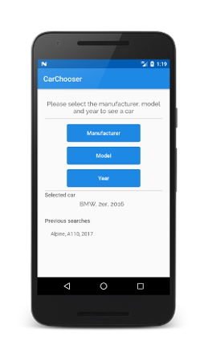

## CarChooser Android App
 
This app is written in Kotlin and has some components that are going to be explained below.

### About its architecture 

The structure of the project is based on the [Google Android Architecture](https://developer.android.com/topic/libraries/architecture/index.html)

* The project architecture is Model-View-ViewModel(MVVM) pattern.
* Views will inform the ViewModel of user interactions.
* ViewModels have the responsibility of the communication with the views through reactive events. They also handle the logic with the data needed for the views.
* The project uses native Android ViewModel, it allows data to survive configuration changes such as screen rotations.
* It also uses data binding for the communication between layout (XML) and ViewModels.
* LiveData is used for handling communication between activities and ViewModels through events. 
* Services package will be responsible for the communication with Jokes API services.

### Language and principal tools

* __Kotlin:__  App language  
https://kotlinlang.org/
* __RxJava2:__  Reactive programming library  
https://github.com/ReactiveX/RxJava
* __Dagger2:__  Framework for dependencies injection  
https://github.com/google/dagger
* __Retrofit:__  HTTP client   
http://square.github.io/retrofit/

### Screens

Portrait views

Landscape views

